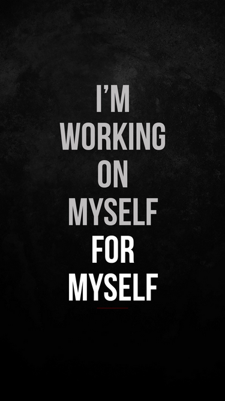

@11:49 A.M. 
I discovered that my thinking has changed since I stared this <strong>Non-Zero Day</strong>, and at times <!--more-->I am almost regretful that I did.  Now when I sit down for a few seconds and do nothing, I start thinking, "you are waisting time and have so much to do, why are you just sitting here doing nothing." almost instantly.  I guess a good thing, as I have been doing mostly nothing all my life. 😂 Not funny, but I cannot help but laugh at my past me putting my present me in this situation. My present me will put my future me in a way better situation! Thank you present me for thinking of future me! ❤️
  
Time for my walk.🚶‍♂️‍➡️

@12:59 P.M. 
Walk complete. Thank you from future me! ❤️ Time to complete task set for the day so the future me will have less to do tomorrow.
  

  
End transmission...
