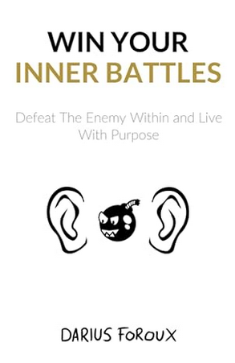

@07:12 P.M. 
I am on my seventh day of Non-Zero Day, and I am struggling! Busy at work and I have not done <!--more-->any of things that I have started. No more than a mile, pushups, situps, read one chapter. ARGH!!! 🤬 But I still have time to do all those things. No rest for the weary!!! BRB...
  

  
I was able to complete <= one mile walk, pushups, situps, started reading "Win your inner battles" by Darius Foroux.

  
I am going to start my fifteen minute meditation right after this update.
  
Thank you me for getting me where I am today and preparing me for tomorrow!
  
End transmission...
