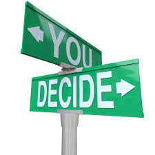

@6:03 A.M. 
I will not turn back. I have been doing well with my Non-Zero Day. This is the best  <!--more-->choice that I have done so far. I am feeling good! Today I will be adding pullups to my daily habits.

Life is just a bunch of choices, fork in the road, and chosing the right path. I know if I have made the best decisions, if I took the right risks or not, met the right people, I can tell if I made the right choices, by where I am at present (today). Some people hold me back and some push me forward. I have been naive most of my life and thought people are good. People are evil. I am where I am because of my faulty thinking. Sure there are good in the world, but most are evil. Not evil as in want me dead, but evil as in, they have their own wants and needs and my role in how they get what they want. My faulty thinking is that I thought people were just like me. 😅 But I am glad that I am in a place now that I know that for me to succeed, I am the one to succeed. As the saying goes, "If it's meant to be, it's up to me." No one can give me muscles, I will have to do the work, and build my muscles. Day after day, I will have to work in building my muscles. Slip and stop for a day, the degeneartion of my hard work starts to show. the hard work that I have put in start to vanish. Once I relized this, I could not unrelize my thought. Just the way life is. If I am not growing, I am declining. No excuses, the choice has always been mine and the choice will always be mine to make.
  

  
Thank you me of the past of recognizing this. Thank you me of today for making my tomorrow a better place for me.
  
End transmission...
