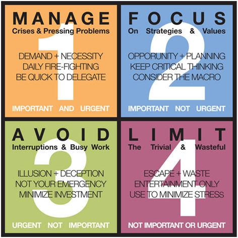
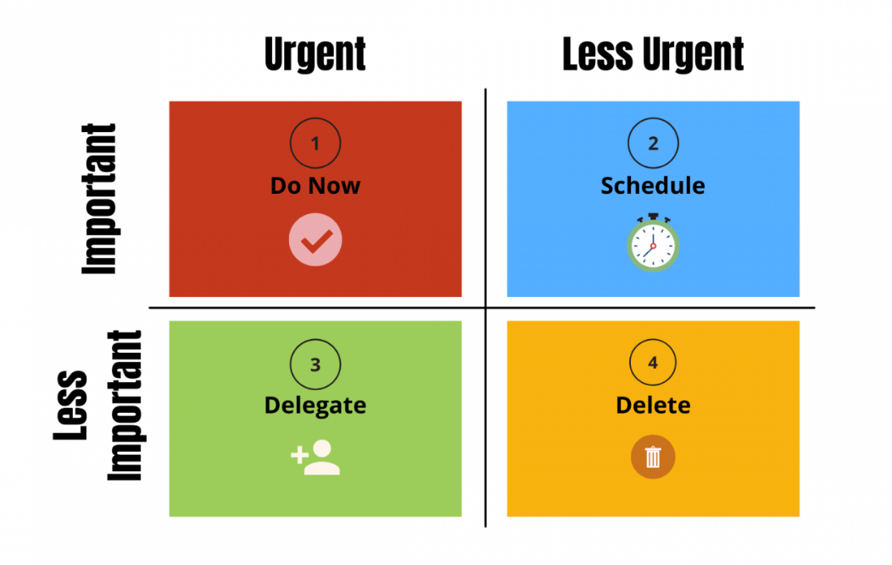

@11:40 P.M. 
If I find myself rushing to finish something at the twelfth hour, that means that I have been <!--more-->procrastinating. I have not been doing what I was supposed to be doing. I have put in place of import something that is urgent. I learned this today. Here I am on the twelfth hour rushing to finish up little thing that are important and did a bunch of urgent things throughout the day.

Here are two matrix of the same about import and urgent to make clear for me.

  

  
    
  

  
Keep going me! Never give up. Learn, adapt, better. Do not ever stop learning, even when learning seems impossible! Thank you me!
  
End transmission...
