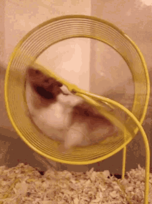

5:52 A.M. 
Woke up and decided to give a go on a note. Might make this into a habit. Journey first thing. 🤔

I received an email that the <!--more-->Supernote Manta is on the way! Whoo hoo!!! I wonder if I will give up my daily pen and paper journaling for e-ink. Time will tell. 

I have gotten so busy at work that I have dropped my responsibilities for myself. I have not studied, exercise or anything else and coming to the end of the month. I have been just working, eating, sleeping and repeating.

  
I am going to make slight changes today and hope the slight change will become a huge one. I am going to layer things where I cannot do them by themselves, such as exercise when working. I have to change this early, before this becomes a habit that I cannot change and then look back and regret!

Time to go start the day!

End transmission…
