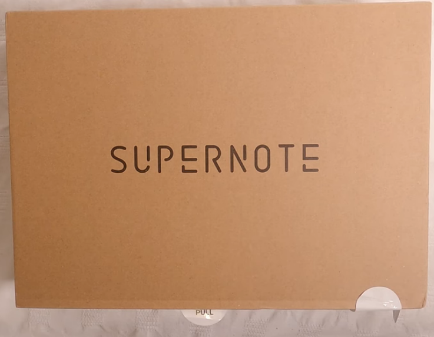
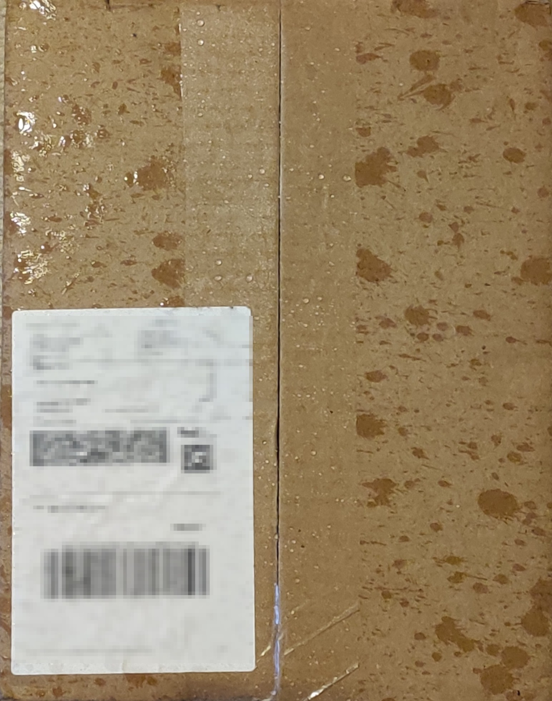
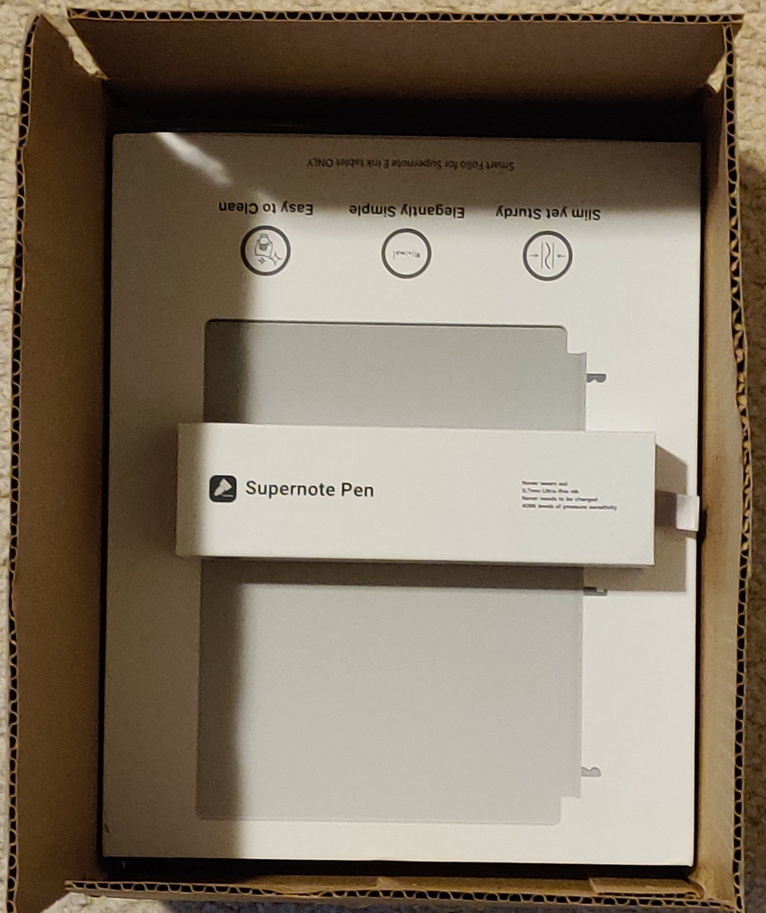
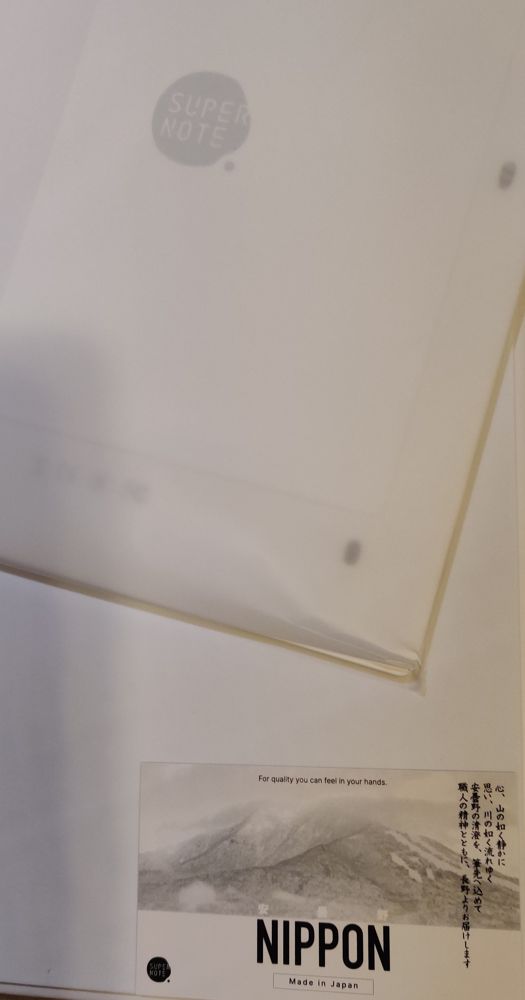
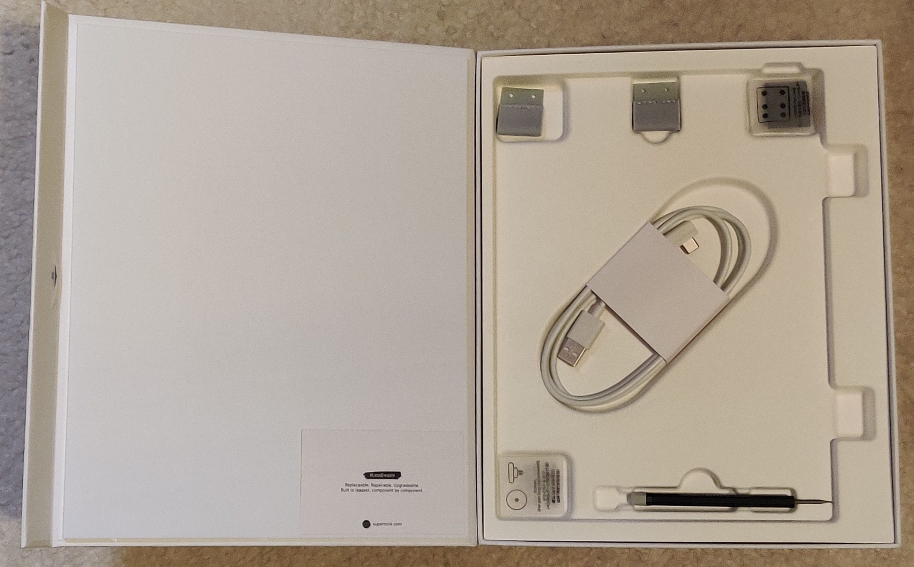
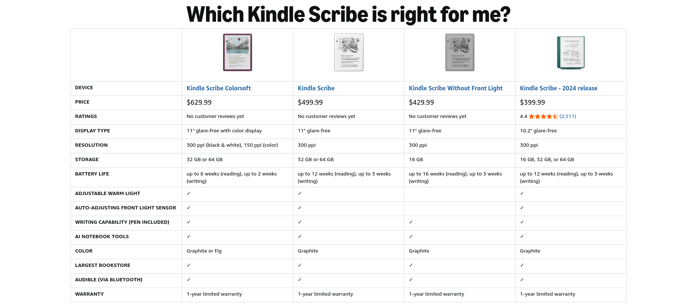
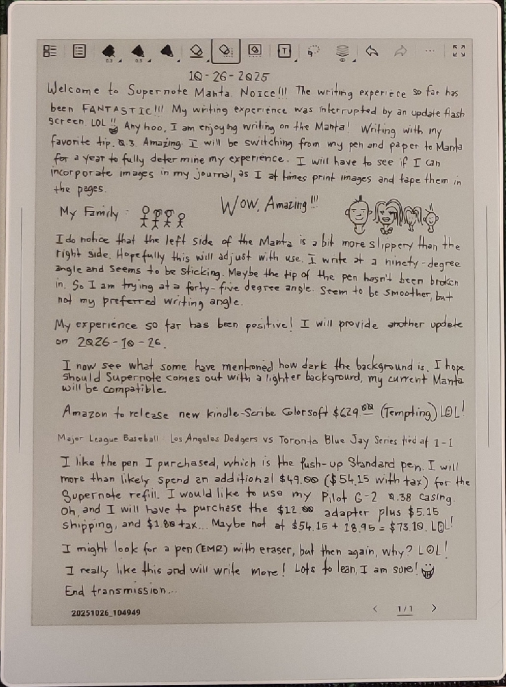

@11:14 P.M. 
In this <a href="https://nonzero.day/2025-10-19/ill" title="Ill" target="_blank">post</a> I stated that I purchased the Supernote Manta. Two days ago, the product <!--more-->arrived!  I was expecting something that I have been seeing on YouTube:
  

  
But instead I received this:
  

  

  

  

  
I expected more for presentation, especially from what I viewed on YouTube, and would also expected that a signature would be required for delivery for such an expensive item (expensive me).  The delivery person placed the item on the porch and took off. Just like Amazon delivery, took a snapshot of the item on the porch as proof of delivery. I waited at home all day to make sure to retrieve the item on arrival, in case a signature was not required. I would hate to battle on an expensive item missing with a proof of delivery. I would be out $700.00!  The day of the delivery there was a storm. As the image of the deliver box shows, the box was a little wet from a few minutes being on the porch after delivery.

I was surprised the box was smaller than what I had viewed on YouTube. When I opened the box, I discoved why!

When I removed the items from the delivery box, I was a bit disapointed, but got over the expectation. But I had further disappointments in unpacking the Manta. The plastic protection was crumpled on the corner, which made me think, how they packed the item. Upon further unpacking I noticed that the screwdriver was not seated properly. Might have been during shipping that the screwdriver got dislodged, but when I tried to place the screwdriver in to fasten the screwdriver in, the screwdriver would not hold in place.

So either what I have been viewing on YouTube are sponsored videos and the YouTubers received upscale demo packaging, or Supernote has raised their prices due to tariffs and cut back on their packaging costs.

Aside from all that, I tried the Supernote Manta, and I really like the Manta. This is my first e-ink tablet, and I do like writing on this device. I am sure I will be doing many things on this device and will be learning a lot as well.  Although Amazon is releasing something new called <a href="https://www.aboutamazon.com/news/devices/new-amazon-kindle-scribe-color" title="Kindle Scribe Color" target="_blank">Kindle Scribe Colorsoft</a>
  

  

  
All these e-ink devices have their cons and pros, just have to know which one best fits my requirements.
  
I have a time management problem, and I hope the Manta will assist in getting this issue situated.
  
End transmission...

