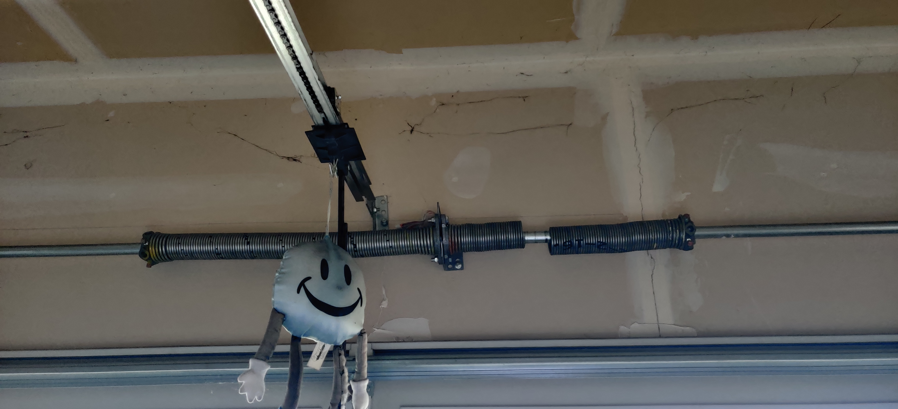
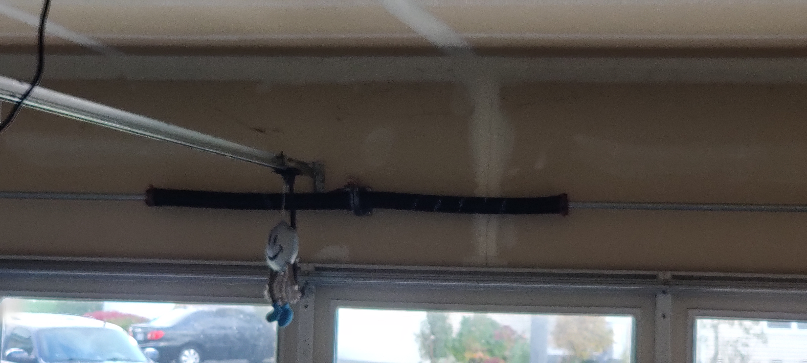
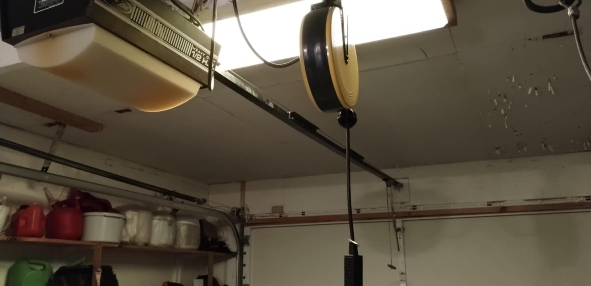
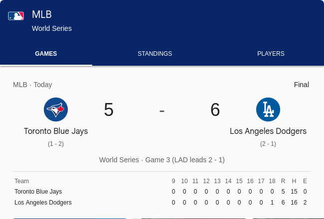

@11:66 P.M. 
What a day. Long day at work, meaning, I was busy. I was closing the garage door and <!--more-->the tension spring snapped! I called around and got one guy that did not charge for free estimate. But once he arrived, the high pitch sale. OH MAN!!! Settled at $730.00 to replace two tension springs. Took about fifteen minutes. Not something I would attempt. I would rather pay the $730.00 than end up in the hospital or worse, in the morgue.  I can always make more money, but I cannot come back from the dead. 😂 He said that the new springs "should" last ten years, if I open and close the three times a day. The life span will shorten with more usuage. I asked him if there are any garage openers that does not require a tension spring, he said no. I looked at my Mom's and her's doesn't have one. Probably why I never thought of something like that ever happening, as my Mom has owned her house over fifty years. So he was wrong!
  
<strong>Broken tension spring</strong> 

  
<strong>New tension spring</strong> 

  
<strong>Mom's garage</strong> 

  
Which reminds me to always check, even triple check when people provide me information. I would think he would know, since he is in the business. But sometimes the people that I think knows the most, knows the least. He did great work, this is coming from a person that knows nothing about garage door openers, except that clicking or pressing a button opens and closes them. But I do know he over charged me, but my time is far more important than to haggle over a few dollars, and having to get another person out to provide another estimate and go through the same. Just get over with and move on!
  
One thing I know, when things start to break, either earn more to be able to replace, or move. I think I will take the latter. 😁
  
2025-10-28@12:03 A.M. 
Game three finally over:
  

  
End transmission...
