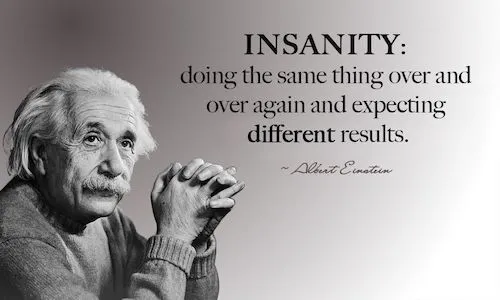

@7:34 a.m. 
I have been reading a lot lately about human behavior and this what I discovered. The secret of life is<!--more--> repitition! Whatever I do most of, that is where I use most of my time, and more than likely become proficient at that something whether I want to or not. If I want to succeed at something that I have passion for, with devotion and determination, set a specific time aside each day, devoted for that task. No matter what, do that task, and I do mean no matter what. Should I break that task by delay or not doing at all, then more than likely than not, I will continue to do the same. Remain consistent! Consistent and repitition is key (the secret sauce) for life success. "If I keep doing what I have been doing, I will keep getting what I have been getting." That statement is neither good nor bad, just depends on the output. If I keep getting what I have been getting and what I am getting is what I want, then keep doing. Should the opposite be true, then change! As Albert Einstein stated:
  

  
<strong>Consistent and Repition is key.</strong>
  
End transmission...
