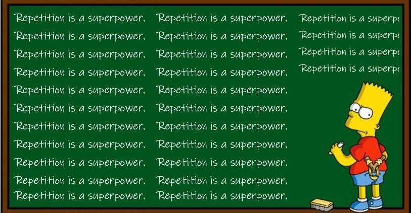

@10:16 P.M. 
New month, new start. I can start all over from my failed attempt at being consistent. Just making an <!--more--> entry daily, that is it! But I failed. I do not have a time management problem, I have a problem in doing what I am supposed to do when I schedule them.  I have my day scheduled, and before I know where the time has gone, I am in left field doing something that is totally not related to what I have schedule myself for. All I have to do is keep my schedule and keep repeating on keeping the schedule. Do not get distracted, if not on the schedule, write the thought and follow-up when my schedule clears. Else I will always be distracted. There are sooo many things I am so behind on and want to completed.There are only so many minutes in a day. Do not waste the day on something that I did not plan.  So common me, let's get this done! 
  

  
Lather, soap, repeat...
  
End transmission...

